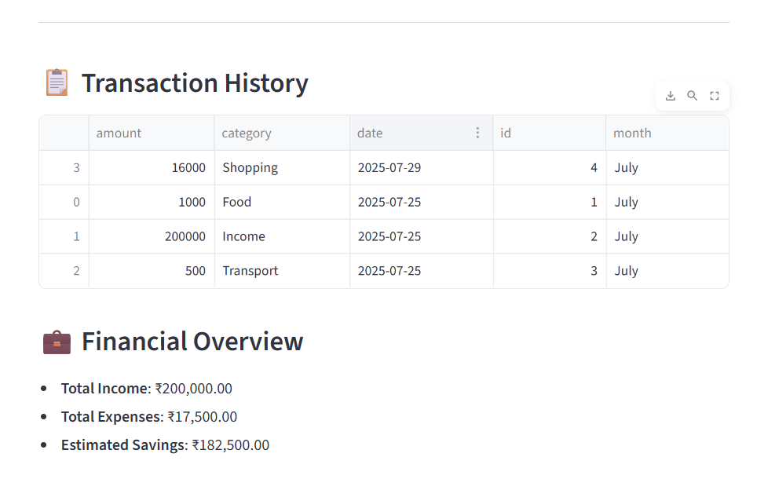
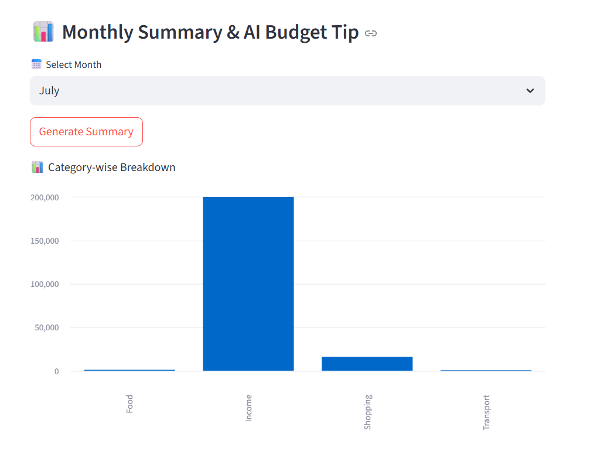
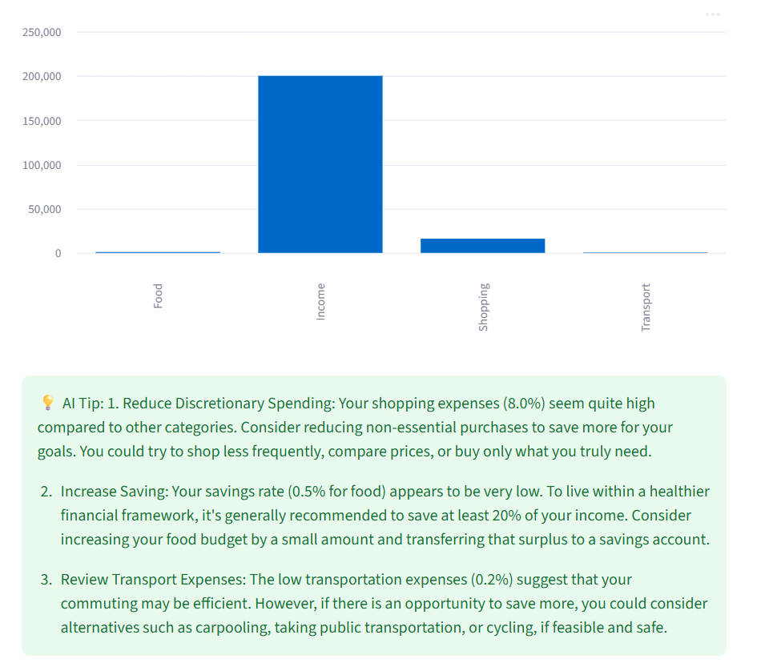

# 💰 Fintrack AI – Smart Budget Tracker


Fintrack AI is your **personal finance assistant** that helps you:

- Log and categorize daily income & expenses  
- Visualize monthly spending patterns  
- Get **AI-powered budget improvement tips**

---

## 🌟 Features

### 🔄 Add & View Transactions
Log your income or expenses and view all history.



---

### 📊 Monthly Summary
Bar chart summarizing your spending by category.



---

### 💡 AI-Powered Budget Tips
Fintrack AI provides **practical suggestions** to optimize your budget.



---

## 🚀 Run Locally

### 1️⃣ Clone the repository

```bash
git clone https://github.com/ruhani11/Fintrack_ai.git
cd Fintrack_ai
```

---

### 2️⃣ Backend Setup (Flask)

```bash
cd server
pip install -r requirements.txt
python app.py
```

Server runs at: [http://localhost:5000](http://localhost:5000)

---

### 3️⃣ Frontend Setup (Streamlit)

```bash
cd ../frontend
pip install -r requirements.txt
streamlit run app.py
```

Frontend runs at: [http://localhost:8501](http://localhost:8501)

---

## 🔐 Environment Variables

Make sure you have the following:

- **Backend (`server/.env`)**

```env
OPENROUTER_API_KEY=your_openrouter_api_key
```

- **Frontend (`frontend/.env`)**

```env
PROJECT_URL=http://localhost:5000
```

---

## 📁 Project Structure

```bash
Fintrack_ai/
│
├── frontend/
│   ├── app.py
│   ├── .env
│   ├── requirements.txt
│
├── server/
│   ├── app.py
│   ├── utils.py
│   ├── .env
│   ├── requirements.txt
│   └── database.db
│
├── AI_Tip.png
├── Budget_Dashboard.png
├── Monthly_summary.png
├── Transaction_history.png
│
└── README.md
```

---

## 🛡 License

MIT License © 2025 [@ruhani11](https://github.com/ruhani11)

---

## 🙌 Acknowledgments

- **OpenRouter.ai** – LLM access  
- **Streamlit** – Simple and interactive frontend
